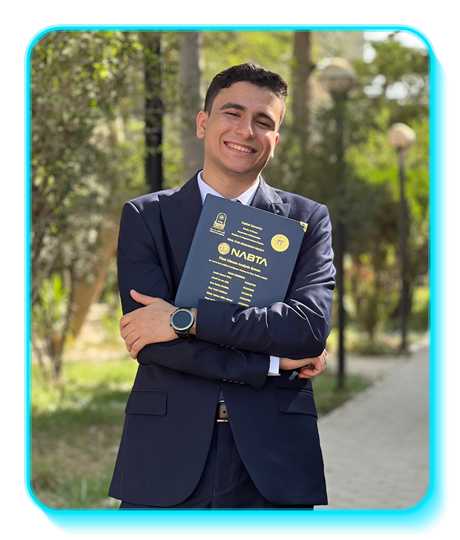
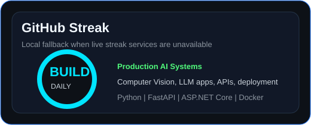
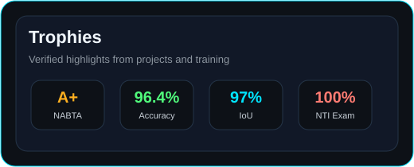

```text
 █████╗ ██████╗ ███╗   ███╗██╗ █████╗   ██████╗  █████╗ ███╗   ███╗ █████╗ ██╗
██╔══██╗██╔══██╗████╗ ████║██║██╔══██╗ ██╔════╝ ██╔══██╗████╗ ████║██╔══██╗██║
███████║██████╔╝██╔████╔██║██║███████║ ██║  ███╗███████║██╔████╔██║███████║██║
██╔══██║██╔══██╗██║╚██╔╝██║██║██╔══██║ ██║   ██║██╔══██║██║╚██╔╝██║██╔══██║██║
██║  ██║██║  ██║██║ ╚═╝ ██║██║██║  ██║ ╚██████╔╝██║  ██║██║ ╚═╝ ██║██║  ██║█████╗
╚═╝  ╚═╝╚═╝  ╚═╝╚═╝     ╚═╝╚═╝╚═╝  ╚═╝  ╚═════╝ ╚═╝  ╚═╝╚═╝     ╚═╝╚═╝  ╚═╝╚════╝
```

<div data-importer="stats" align="center">
  
  
</div>

<div align="center">
  <h3>AI Backend Engineer</h3>
  <p>
    <strong>Computer Vision Systems</strong> ·
    <strong>LLMs</strong> ·
    <strong>FastAPI</strong> ·
    <strong>ASP.NET Core</strong>
  </p>

  <a href="https://git.io/typing-svg">
    
  </a>

  <br />
  <br />

  <a href="https://github.com/Armia-Gamal" target="_blank">
    
  </a>
  <a href="https://linkedin.com/in/armia-gamal" target="_blank">
    
  </a>
  <a href="https://armia-gamal.me" target="_blank">
    
  </a>
  <a href="https://kaggle.com/armia123" target="_blank">
    
  </a>
  <a href="mailto:armia.gamalll@gmail.com" target="_blank">
    
  </a>
</div>

<br clear="right" />

## About Me

```bash
armia@github:~$ whoami

Name        : Armia Gamal Fekry
Role        : AI Backend Engineer
Focus       : Computer Vision Systems, LLM Applications, RAG, Backend APIs
Location    : Cairo, Egypt
Education   : B.Sc. Computer Science & Statistics, Helwan University
CGPA        : 3.504 / 4.0, Grade A
Status      : Open to AI Engineer, Backend Engineer, and Computer Vision roles
Languages   : Arabic Native, English Professional Working Proficiency

Mission     : Build production-ready AI systems that are accurate, scalable, and useful.
```

<p align="left">
  Fresh Computer Science graduate with practical experience in AI, Computer Vision, and Backend Development through internships and real-world projects. Skilled in developing end-to-end AI solutions, RESTful APIs, and scalable applications using Python, TensorFlow, PyTorch, FastAPI, and ASP.NET Core.
</p>

## Tech Stack

<h3>Programming Languages</h3>
<p align="left">
  
</p>

<h3>Artificial Intelligence</h3>
<p align="left">
  
  
  
</p>

<h3>Computer Vision</h3>
<p align="left">
  
  
  
  
  
</p>

<h3>LLMs</h3>
<p align="left">
  
  
  
  
  
  
</p>

<h3>Backend</h3>
<p align="left">
  
  
  
  
</p>

<h3>Frontend</h3>
<p align="left">
  
  
</p>

<h3>Databases</h3>
<p align="left">
  
  
  
</p>

<h3>Cloud</h3>
<p align="left">
  
  
  
</p>

<h3>DevOps</h3>
<p align="left">
  
  
</p>

<h3>Tools</h3>
<p align="left">
  
  
  
  
</p>

## Featured Projects

<div align="left">
  <div style="border:1px solid #30363D;border-radius:18px;padding:22px;margin:18px 0;background:#0D1117;">
    <h3>NABTA — AI-Powered Plant Disease Detection & Smart Agricultural Assistant</h3>
    <p>End-to-end AI agriculture platform for plant disease diagnosis, crop health monitoring, explainable predictions, and bilingual AI assistance.</p>
    <p>
      
      
      
      
      
      
      
      
    </p>
    <p><strong>Key achievements:</strong> Graduation Project Grade A+, 120K+ images, 102 disease classes, 96.4% classification accuracy, 94.1% detection mAP, 91.8% segmentation IoU, Grad-CAM explainability, Arabic and English RAG assistant.</p>
    <p>
      <a href="https://github.com/Armia-Gamal/YOLO-U-Net-CNN-Plant-Disease" target="_blank">
        
      </a>
      <a href="https://nabta-system.tech" target="_blank">
        
      </a>
    </p>
  </div>

  <div style="border:1px solid #30363D;border-radius:18px;padding:22px;margin:18px 0;background:#0D1117;">
    <h3>Flood Water Segmentation — Multispectral Satellite AI</h3>
    <p>Semantic segmentation system for flood area detection using 12-channel multispectral satellite imagery.</p>
    <p>
      
      
      
      
      
    </p>
    <p><strong>Key achievements:</strong> Custom U-Net in TensorFlow, ResNet34 U-Net in PyTorch, high IoU performance up to 97%, preprocessing and augmentation pipeline for accurate water detection.</p>
    <p>
      <a href="https://github.com/Armia-Gamal/Flood-Water-Segmentation-Using-Multispectral-Satellite-Data" target="_blank">
        
      </a>
    </p>
  </div>

  <div style="border:1px solid #30363D;border-radius:18px;padding:22px;margin:18px 0;background:#0D1117;">
    <h3>Shoplifting Detection System — Real-Time Video AI</h3>
    <p>End-to-end suspicious activity detection system using video classification and temporal modeling.</p>
    <p>
      
      
      
      
      
    </p>
    <p><strong>Key achievements:</strong> 3D CNN and MobileNetV2 modeling, real-time prediction workflow, Django REST API integration, Streamlit interface, sequence-based activity detection.</p>
    <p>
      <a href="https://github.com/Armia-Gamal/shoplifting-detection-system" target="_blank">
        
      </a>
    </p>
  </div>
</div>

## GitHub Statistics

<div align="center">
  
  
</div>


## Currently Learning

```python
learning = {
    "Computer Vision": [
        "Vision Transformers",
        "SAM 2",
        "RT-DETR",
        "Production CV Pipelines",
    ],
    "LLMs": [
        "LangGraph",
        "Agents",
        "Multi-Agent Systems",
        "Evaluation Pipelines",
    ],
    "Backend": [
        "ASP.NET Core",
        "FastAPI",
        "Microservices",
        "Scalable API Architecture",
    ],
    "Cloud": [
        "AWS",
        "Docker",
        "CI/CD",
        "Model Deployment",
    ],
}
```

## Contact

<div align="center">
  <a href="mailto:armia.gamalll@gmail.com" target="_blank">
    
  </a>
  <a href="tel:+201030594837" target="_blank">
    
  </a>
  <a href="https://linkedin.com/in/armia-gamal" target="_blank">
    
  </a>
  <a href="https://github.com/Armia-Gamal" target="_blank">
    
  </a>
  <a href="https://kaggle.com/armia123" target="_blank">
    
  </a>
  <a href="https://armia-gamal.me" target="_blank">
    
  </a>
</div>


